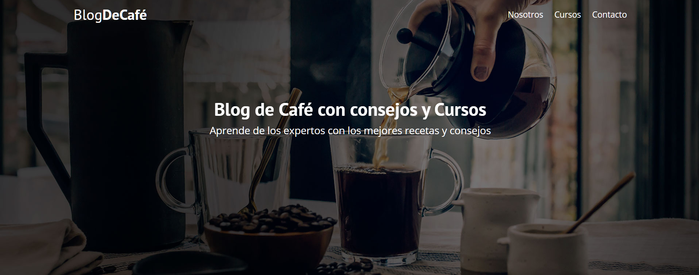

<!-- Please update value in the {}  -->

<h1 align="center">Blog Café</h1>

  <h3>
    <a href="https://sedian27.github.io/blogcafe/">
      Demo
    </a>
  </h3>

<!-- TABLE OF CONTENTS -->

## Contenido

- [Contenido](#contenido)
- [Descripción](#descripción)
  - [Tecnologías](#tecnologías)
- [Características](#características)
- [Contact](#contact)

<!-- OVERVIEW -->

## Descripción

### Tecnologías

<!-- This section should list any major frameworks that you built your project using. Here are a few examples.-->

- HTML5
- CSS3

## Características

<!-- List the features of your application or follow the template. Don't share the figma file here :) -->

Esta pagina fue creada cómo practica de los conocimientos adquiridos.

## Contact

- GitHub [@sedian27](https://github.com/sedian27)
